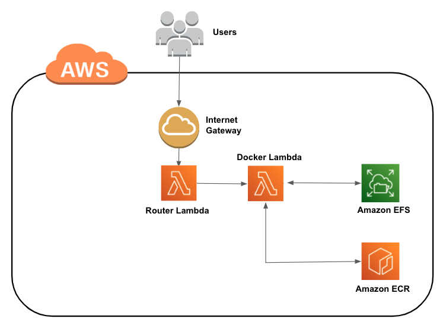

# Serverless Huggingface Demos with AWS Lambda

### Note: This code is meant as a demo. You should secure access to demos once deployed. 

This project builds off of the [Zero administration inference with AWS Lambda](https://github.com/aws-samples/zero-administration-inference-with-aws-lambda-for-hugging-face). Our solution leverages the techniques used to package and deploy open source natural language processing models downloaded from [Hugging Face](https://huggingface.co/) and extends the approach to provide quick prototypes to share with stateholders. At a high-level, we'd like to be able to select a new open source model from Hugging Face and have a prototype that we could share with stakeholders as quickly as possible with minimal code development or changes. 

## Overview

Our solution consists of an [AWS Cloud Development
Kit](https://aws.amazon.com/cdk/) (AWS CDK) script that automatically
provisions container image-based Lambda functions that perform ML
inference using pre-trained Hugging Face models. This solution also
includes [Amazon Elastic File System](https://aws.amazon.com/efs/) (EFS)
storage that is attached to the Lambda functions to cache the
pre-trained models and reduce inference latency.



In this architectural diagram:
1.  Serverless inference is achieved by using Lambda functions that are
    based on container image.
2.  The container image is stored in an [Amazon Elastic Container
    Registry](https://aws.amazon.com/ecr/) (ECR) repository within your
    account.
3.  Pre-trained models are automatically downloaded from Hugging Face
    the first time the function is invoked.
4.  Pre-trained models are cached within Amazon Elastic File System
    storage in order to improve inference latency.
5.  Another Lambda function is implemented to provide a web-based user
    interface and access each model. 

## Prerequisites
The following software is required to run and deploy this project:
-   [git](https://git-scm.com/)
-   [AWS CDK v2](https://docs.aws.amazon.com/cdk/latest/guide/getting_started.html)
-   [Python](https://www.python.org/) 3.6+
-   [A virtual env](https://docs.python.org/3/library/venv.html#module-venv) (optional)

Provided that the required software is in place, it should be possible to deploy a 
new instance of this demo project by executing the following commands.  

## Deploying the example application
1.  Clone the project to your development environment:
```bash
git clone <https://github.com/aws-samples/zero-administration-inference-with-aws-lambda-for-hugging-face.git>
```
2. Setup and activate a virual environment. This is optional but recommended. 
```bash
python -m venv .venv
```
Activating your virtual environment will be different based on if you are using a MacOS, Linux, or Windows environment. 
MacOS and Linux
```bash
source .venv/bin/activate
```
Windows
```bash
.venv\Scripts\activate
```

3.  Install the required dependencies:
```bash
pip install -r requirements.txt
```
4.  Bootstrap the CDK. This command provisions the initial resources
    needed by the CDK to perform deployments:
```bash
cdk bootstrap
```
5.  This command deploys the CDK application to its environment. During
    the deployment, the toolkit outputs progress indications:
```bash
cdk deploy
```

After running these steps, the Cloud Development Kit (CDK) will ask you to confirm that 
you would like to deploy all of the resources required for this project 
to the default region configured for the CDK. Once you've confirmed that 
you'd like to deploy the solution, the CDK will 
create and configure all the services necessary to support this solution.


Once the deployment has completed, the output of the stack deployment will 
be a public URL that you can share with stakeholders which will allow them 
to experiement with open source nlp models running serverlessly in a specific 
AWS account and region. 

## Why host open source models?
Before we dive into the details of the solution, let's consider why we might 
want to work with open source models hosted in our own AWS account rather than 
use models hosted by 3rd parties or models hosted serverlessly by AWS Bedrock. 
Here are a few reasons. 
1. When we host our how models, we don't have to share our data with 3rd parties. 
2. Hugging Face hosts hundreds of thousands of models and new models are 
uploaded every day. Being able to deploy the latest models provides a mechanism
to leverage the latest advancements. 
3. We have the flexibility to deploy fine-tuned models which are more accurate, 
faster, or cheaper to run for our proprietary data or unique use cases.

## Architecture
Let's take a closer look at the the resource the CDK is provisioing for this 
application. Our recipie for this deployment can be found in the app.py file. 
At the top of the file we can see the imports for the services that the CDK project
will be using to deploy and configure this application. 

```python
from aws_cdk import (
    aws_lambda as lambda_,
    aws_efs as efs,
    aws_ec2 as ec2,
    aws_apigateway as apigateway
)
```
- We will be using AWS Lambda to serverlessly host our models and the user interface 
for out app. Lambda can scale-up quickly to support hundreds of concurrent requests and 
then scale back down to zero when there is no traffic. 
- This project uses the Elastic File System (EFS) to cache the files for any models 
that we download from Hugging Face. If you aren't familiar with EFS, it works as a 
network drive that we share with multiple lambda functions and other compute resources. 
- Next we will be using an instance on the Elastic Compute Cloud (EC2) to build the 
Docker images that will host our models. The Hugging Face transformer libray detects 
the runtime environment and downloads the appropriate files for the environment it 
will be running in. 
- And finally, the project will use the Amazon API Gateway to configure a public RESTful 
HTTP API to allow GET and POST requests to our application. 

Unlike in the original [Zero administration inference with AWS Lambda](https://github.com/aws-samples/) 
project, this project needs to keep track or the Amazon Resource Names (ARNs) for each Docker Lambda. 
ARNs uniquely identify AWS resources and the router Lambda function will use the ARNs to 
call each Docker lambda function that gets created. The CDK project saves the ARNs for 
each Docker lambda in a dictionary which will later be passed to the router lambda a 
environment variables. 

```python
passed_environment_variables["functionARN"+str(count)] = docker_lambda.function_arn
```

Once we have collected all the ARNs for the Docker lambdas, we can create our router 
lambda function and pass all the ARNs in as environment variables. 

```python
        # Lambda Function to route requests to the Docker Lambda Functions
        self.router_lambda = lambda_.Function(
            scope=self,
            id="LambdaRouter",
            runtime=lambda_.Runtime.PYTHON_3_12,
            function_name="LambdaRouter",
            code=lambda_.Code.from_asset(
                path="lambda"
            ),
            handler="router.handler",
            # The environment variables for the Lambda function are passed here.
            environment=passed_environment_variables,
        )
```

The location of the router lambda code will be saved in the router.py file in the lambda
folder. We will revisit this code in more detail once we have reviewed the remainder of
the app.py CDK code. 

Once we have defined our router lambda function, we can create a public API Gateway
endpoint to handle HTTP GET and POST requests to our application. 

```python
        # API Gateway to provide a public endpoint for the router Lambda Function
        api = apigateway.LambdaRestApi(
            self,
            "LambdaRouterApi",
            handler = self.router_lambda,
            proxy = False,
        )
        api_resource = api.root.add_resource("go")
        api_resource.add_method("GET")
        api_resource.add_method("POST")
```

And finally, we need to grant the router lambda function permission to access each 
of the Docker lambda functions that we've created. We do this by calling the grant_invoke
method on each docker_lambda instance and pass it the router_lambda instance we wan to 
provide invoke permission. 

```python
        #Grant invoke permissions to the router lambda
        for docker_lambda in docker_lambdas:
            docker_lambda.grant_invoke(self.router_lambda)
```

## Infrastucture as Code
The app.py file defines all of the resources needed to run our application. Defining all 
of our infrastructure resources as code is referred to as Infrastructure as Code (IaC). 
Using code and software development techniques, rather than manually configuring systems enables developers and IT operations teams to automatically provision resources. This provides some key benifits such as:

# Key Features of Infrastructure as Code:
1. Automation: IaC automates the provisioning of infrastructure, reducing the human error associated with manual setups. It allows for the quick setup of environments from development to production through scripts.
2. Consistency: By defining your infrastructure in source code, IaC helps maintain consistency across environments, reducing discrepancies and incompatibilities between development, testing, and production environments.
3. Version Control: Infrastructure configurations can be versioned and tracked using the same version control systems used for software development (such as Git). This enables changes to be tracked over time, rollbacks to be made if necessary, and understanding who made changes and why.
4. Reusability: Code used to define infrastructure can be reused for different environments or solutions, saving time and reducing the risk of errors when configuring new infrastructure.
5. Cost-Effective: With IaC, organizations can quickly spin up and tear down environments, which optimizes cloud resource usage and keeps costs under control.

## Hugging Face Models

[Hugging Face](https://huggingface.co/) Transformers is a popular
open-source project that provides pre-trained, natural language
processing (NLP) models for a wide variety of use cases. Customers with
minimal machine learning experience can use pre-trained models to
enhance their applications quickly using NLP. This includes tasks such
as text classification, language translation, summarization, and
question answering - to name a few.

This application includes example Python scripts for two common NLP use cases:
-   Sentiment analysis: Identifying if a sentence indicates positive or negative sentiment. It uses a fine-tuned model on sst2, which is a [GLUE task](https://arxiv.org/abs/1804.07461).
-   Summarization: Summarizing a body of text into a shorter, representative text. It uses a [Bart](https://arxiv.org/abs/1910.13461) [model](https://huggingface.co/transformers/model_doc/bart.html) that was fine-tuned on the [CNN / Daily Mail dataset](https://github.com/abisee/cnn-dailymail).
For simplicity, both of these use cases are implemented using Hugging
Face
[pipelines](https://huggingface.co/transformers/main_classes/pipelines.html).


## Understanding the code structure
The code is organized using the following structure:
```bash
├── inference
│   ├── Dockerfile
│   ├── sentiment.py
│   └── summarization.py
├── app.py
└── ...
```

The ```inference``` directory contains:
-   The ```Dockerfile``` used to build a custom image to be able to run PyTorch Hugging Face inference using Lambda functions
-   The Python scripts that perform the actual ML inference

The ```sentiment.py``` script shows how to use a Hugging Face Transformers
model:

```python
import json
from transformers import pipeline

nlp = pipeline("sentiment-analysis")

def handler(event, context):
    response = {
        "statusCode": 200,
        "body": nlp(event['text'])[0]
    }
    return response
```
For each Python script in the inference directory, the CDK generates a
Lambda function backed by a container image and a Python inference
script.

## Adding a translator 
You could add more models by adding additional Python scripts in the
inference directory. For example, you could add a new model to translate 
English text to French by adding the following code in a file
called ```translate-en2fr.py``` to the inference directory:
```python
import json
from transformers
import pipeline

en_fr_translator = pipeline('translation_en_to_fr')

def handler(event, context):
    response = {
        "statusCode": 200,
        "body": en_fr_translator(event['text'])[0]
    }
    return response
```
Then you would cdk deploy again to create a new Docker lambda funtion to
perform English to French translation:
```bash
$ cdk deploy
```

## The router lambda

The code for the router lambda can be found in the ```router.py``` file in the 
lambda directory. When the application is accessed via and HTTP GET, such was when 
the enpoint is accessed in a web browser, the router lambda returns a simple 
HTML form. 

```python
http_method = event.get('httpMethod')
    
if http_method == 'GET':
    return {"statusCode": 200,
        "headers": {"content-type": "text/html"},
        "body": html}
```


Our simple HTML form is then designed to POST the contents of a text box 
back to our router lambda whenever the submit button is pressed. When 
the router lamba detects POST request, it checks to see if a specific 
Docker lambda has been requested. If none is found in the request, it 
defaults to using the ARN for the first Docker lambda passed via the
environment variables for the router lambda.  

```python
elif http_method == 'POST':
        body = json.loads(event['body'])
        text = body['text']
        functionARN = os.getenv("functionARN1")
        if "functionARN" in body:
            functionARN = body['functionARN']
    
        result = get_response(text, functionARN)
```

In the get_response method, the boto3 lambda client is used to call the Docker lambda
identified by the ARN that is passed in. 

```python
def get_response(text, functionARN):
        lambda_client = boto3.client('lambda')
        try:
            # Parameters to invoke the other Lambda function
            response = lambda_client.invoke(
                FunctionName=functionARN,  
                InvocationType='RequestResponse', 
                Payload=json.dumps({'text': text}) 
            )

            # Read and parse the response payload
            response_payload = response['Payload'].read().decode('utf-8')
            response_data = json.loads(response_payload)
            return {
                    'message': 'Invocation successful',
                    'responseFromLambda': response_data
                }
```


## Cleaning up
After you are finished experimenting with this project, run ```cdk destroy``` to remove all of the associated infrastructure.

## License
This library is licensed under the MIT No Attribution License. See the [LICENSE](LICENSE) file.
Disclaimer: Deploying the demo applications contained in this repository will potentially cause your AWS Account to be billed for services.

## Links
- [:hugs:](https://huggingface.co)
- [AWS Cloud Development Kit](https://aws.amazon.com/cdk/)
- [Amazon Elastic Container Registry](https://aws.amazon.com/ecr/)
- [AWS Lambda](https://aws.amazon.com/lambda/)
- [Amazon Elastic File System](https://aws.amazon.com/efs/)